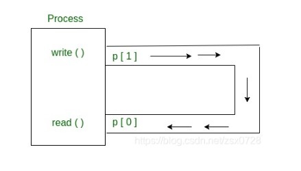

### 一、wait()
### 二、共享内存
```C
int shm_open(const char *name, int oflag, mode_t mode);//打开创建共享内存文件
//  返回值:成功返回fd>0
//        失败返回fd<0
int shm_unlink(const char *name);//删除共享内存
int ftruncate(int fd, off_t length);//重置共享内存文件大小
void *mmap(void *addr, size_t length, int prot, int flags,int fd, off_t offset);//地址映射
/*
参数说明：
    addr：   建立映射区的首地址，由Linux内核指定。使用时，直接传递NULL
    length： 欲创建映射区的大小
    prot：   映射区权限PROT_READ、PROT_WRITE、PROT_READ|PROT_WRITE
    flags：  标志位参数(常用于设定更新物理区域、设置共享、创建匿名映射区)
            MAP_SHARED:  会将映射区所做的操作反映到物理设备（磁盘）上,无血缘关系的进程通信
            MAP_PRIVATE: 映射区所做的修改不会反映到物理设备。
            MAP_ANONYMOUS:匿名映射区
    fd：     用来建立映射区的文件描述符
    offset： 映射文件的偏移(4k的整数倍)
*/
int munmap(void *addr, size_t length);//解除映射


/**
 * @brief 
 * int shm_open(const char *name, int oflag, mode_t mode);
 * 
 * 功能说明：shm_open　用于创建或者打开共享内存文件。笔者认为shm_open 也许仅仅是系统函数open的一个包装，不同之处就是shm_open操作的文件一定是位于tmpfs文件系统里的，常见的Linux发布版的tmpfs文件系统的存放目录就是/devm。
 * 
 * 返回值:shm_open函数的返回值是一个文件描述符（file descriptor），它是一个非负整数。文件描述符是用来标识打开文件或其他I/O资源的句柄。
 * 如果shm_open成功创建或打开共享内存对象，则返回一个有效的文件描述符。该文件描述符可以用于后续操作，比如读取、写入、映射到内存等。如果shm_open失败，则返回-1，并设置适当的错误代码，表示出现了错误。
 * 
 * 参数说明：
 * 
 * name：要打开或创建的共享内存文件名，由于shm_open　打开或操作的文件都是位于/devm目录的，因此name不能带路径，例如：ar/myshare 这样的名称是错误的，而 myshare 是正确的，因为 myshare 不带任何路径。如果你一定要在name添加路径，那么，请在/devm目录里创建一个目录，例如，如果你想创建一个  bill/myshare 的共享内存文件，那么请先在/devm目录里创建 bill这个子目录，由于不同厂家发布的linux系统的tmpfs的位置也许不是/devm，因此带路径的名称也许在别的环境下打开不成功。
 * 
 * oflag：打开的文件操作属性：O_CREAT、O_RDWR、O_EXCL的按位或运算组合
 * O_CREAT用于创建共享内存对象（或文件），如果已经存在则不创建。
 * O_RDWR用于以可读可写方式打开共享内存对象。
 * O_EXCL用于确保创建的共享内存对象是独占的，不与其他进程共享。
 * 
 * mode：文件共享模式，例如 0777
 * S_IRUSR（所有者可读）: 0400
 * S_IWUSR（所有者可写）: 0200
 * S_IXUSR（所有者可执行）: 0100
 * S_IRGRP（组用户可读）: 0040
 * S_IWGRP（组用户可写）: 0020
 * S_IXGRP（组用户可执行）: 0010
 * S_IROTH（其他用户可读）: 0004
 * S_IWOTH（其他用户可写）: 0002
 * S_IXOTH（其他用户可执行）: 0001
 * 可以使用按位或（|）操作符将这些常量组合起来，以设置所需的权限。
 */

/**
 * @brief 
 * void* mmap(void *addr, size_t length, int prot, int flags,int fd, off_t offset);
 * 功能说明: 将打开的文件映射到内存，一般是将shm_open打开的文件映射到内存，当然也可以将硬盘上的用open函数打开的文件映射到内存。这个函数只是将文件映射到内存中，使得我们用操作内存指针的方式来操作文件数据。
 * 参数说明：
 * addr：要将文件映射到的内存地址，一般应该传递NULL来由Linux内核指定。
 * length：要映射的文件数据长度。
 * prot：映射的内存区域的操作权限（保护属性），包括PROT_READ、PROT_WRITE、PROT_READ|PROT_WRITE
 * PROT_READ：可读权限。
 * PROT_WRITE：可写权限。
 * PROT_EXEC：可执行权限。
 * 这些权限可以通过按位或（|）进行组合。
 * flags：标志位参数，包括：MAP_SHARED、MAP_PRIVATE与MAP_ANONYMOUS。
 * MAP_SHARED: 建立共享，用于进程间通信，如果没有这个标志，则别的进程即使能打开文件，也看不到数据。
 * MAP_PRIVATE: 只有进程自己用的内存区域
 * MAP_ANONYMOUS: 匿名映射区
 * fd：用来建立映射区的文件描述符，用 shm_open打开或者open打开的文件。
 * offset：映射文件相对于文件头的偏移位置，应该按4096字节对齐。
 * 返回值:成功返回映射的内存地址指针，可以用这个地址指针对映射的文件内容进行读写操作，读写文件数据如同操作内存一样；如果 失败则返回NULL。
 */

/**
 * @brief 
 * int ftruncate(int fd, off_t length);
 * 功能说明：重置文件大小。任何open打开的文件都可以用这个函数，不限于shm_open打开的文件。
 * fd：文件描述符，表示要改变大小的文件。
 * length：新的文件大小，单位是字节。
 * ftruncate函数将文件的大小截断为指定的长度，可能会有以下几种情况：
 * 如果length小于文件的当前大小，文件将被截断，超过length部分的数据将被丢弃。
 * 如果length大于文件的当前大小，文件将被扩展，超过当前大小但在length之前的部分将被填充为零字节。
 * ftruncate函数的返回值为0表示成功，-1表示失败，并设置相应的错误码。
 */

```
### 三、管道
#### 基本概念
    从概念上讲，管道是两个进程之间的连接，一个进程的标准输出成为另一个进程的标准输入。在UNIX操作系统中，管道用于进程间通信。

* 管道只是单向通信，即我们可以这样使用管道：一个进程向管道写入数据，另一个进程从管道读取数据。管道，是内存中被视为“虚拟文件”的一块区域。
* 管道可以被创建进程及其所有子进程读写。一个进程可以写入这个“虚拟文件”或管道，另一个相关进程可以从中读取。
* 如果在某个内容写入管道之前，某个进程试图读取该内容，则该进程将挂起，直到内容被写入。
* 管道系统调用在进程的打开文件表中找到前两个可用位置，并将其分配给管道的读取和写入端。

```C
int pipe(int fds[2]);

// 参数：
// fd[0] 将是管道读取端的fd（文件描述符）
// fd[1] 将是管道写入端的fd
// 返回值：0表示成功，-1表示失败。
```
```C
// C program to illustrate 
// pipe system call in C 
#include <stdio.h> 
#include <unistd.h> 
#define MSGSIZE 16 
char* msg1 = "hello, world #1"; 
char* msg2 = "hello, world #2"; 
char* msg3 = "hello, world #3"; 
  
int main() 
{ 
    char inbuf[MSGSIZE]; 
    int p[2], i; 
  
    if (pipe(p) < 0) 
        exit(1); 
  
    /* continued */
    /* write pipe */
  
    write(p[1], msg1, MSGSIZE); 
    write(p[1], msg2, MSGSIZE); 
    write(p[1], msg3, MSGSIZE); 
  
    for (i = 0; i < 3; i++) { 
        /* read pipe */
        read(p[0], inbuf, MSGSIZE); 
        printf("% s\n", inbuf); 
    } 
    return 0; 
} 
/* 输出
hello, world #1
hello, world #2
hello, world #3
*/
```

#### 父子进程共享管道
    当我们在任何进程中使用fork时，文件描述符在子进程和父进程之间保持打开状态。如果我们在创建管道后调用fork，则父级和子级可以通过管道进行通信。


```C
// C program to illustrate 
// pipe system call in C 
// shared by Parent and Child 
#include <stdio.h> 
#include <unistd.h> 
#define MSGSIZE 16 
char* msg1 = "hello, world #1"; 
char* msg2 = "hello, world #2"; 
char* msg3 = "hello, world #3"; 
  
int main() 
{ 
    char inbuf[MSGSIZE]; 
    int p[2], pid, nbytes; 
  
    if (pipe(p) < 0) 
        exit(1); 
  
    /* continued */
    if ((pid = fork()) > 0) { 
        write(p[1], msg1, MSGSIZE); 
        write(p[1], msg2, MSGSIZE); 
        write(p[1], msg3, MSGSIZE); 
  
        // Adding this line will 
        // not hang the program 
        // close(p[1]); 
        wait(NULL); 
    } 
  
    else { 
        // Adding this line will 
        // not hang the program 
        // close(p[1]); 
        while ((nbytes = read(p[0], inbuf, MSGSIZE)) > 0) 
            printf("% s\n", inbuf); 
        if (nbytes != 0) 
            exit(2); 
        printf("Finished reading\n"); 
    } 
    return 0; 
} 
/*
hello world, #1
hello world, #2
hello world, #3
(hangs)         //program does not terminate but hangs
*/
```
在Linux中，`read()`和`write()`是两个用于文件操作的系统调用函数，它们在管道通信中经常被使用。下面是它们的参数说明：

对于`read()`函数：
- 参数1：文件描述符（file descriptor），表示要读取数据的文件描述符。
- 参数2：缓冲区（buffer），用于存储读取到的数据。
- 参数3：读取数据的最大字节数。
- 返回值：实际读取到的字节数。如果返回值为0，表示已经到达文件末尾；若返回-1，表示读取出错，可以通过`errno`变量获取具体错误信息。

对于`write()`函数：
- 参数1：文件描述符，表示要写入数据的文件描述符。
- 参数2：要写入的数据缓冲区。
- 参数3：要写入的字节数。
- 返回值：实际写入的字节数。如果返回值为-1，表示写入出错，可以通过`errno`变量获取具体错误信息。

在使用这两个函数时，需要注意以下几点：
1. `read()`和`write()`是阻塞的系统调用，如果对应的文件描述符没有数据可读或无法写入数据，调用将会被阻塞，直到有数据可读或有空闲空间可写入。
2. 可以多次调用`read()`和`write()`来读取/写入大于缓冲区大小的数据，直到读取/写入所需的字节数。
3. `read()`和`write()`可以用于读写管道、文件、网络套接字等。

需要注意的是，以上是`read()`和`write()`函数在文件操作中的基本用法说明，并非仅限于管道通信。这两个函数在Linux系统编程中非常常用，可用于各种类型的文件和通信方式。


* 最后需要关闭管道