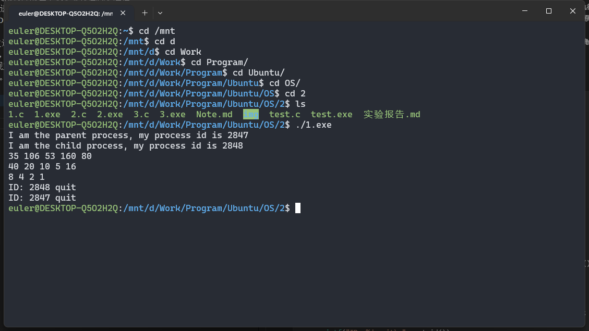
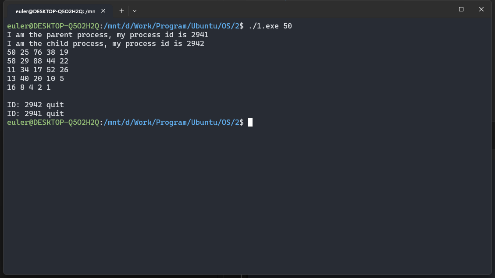
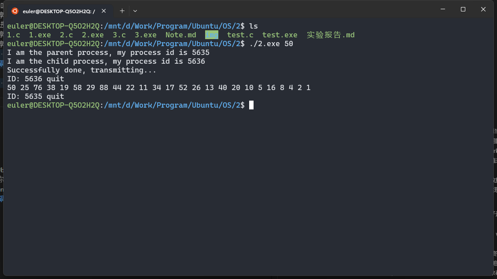
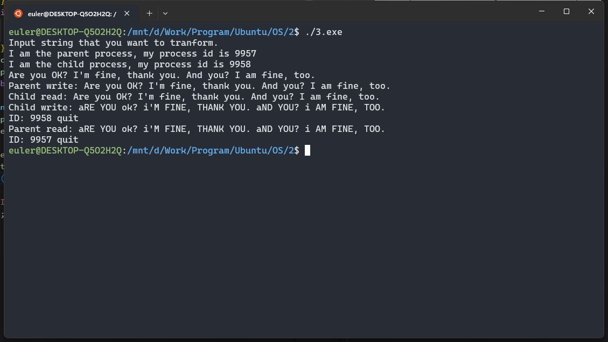
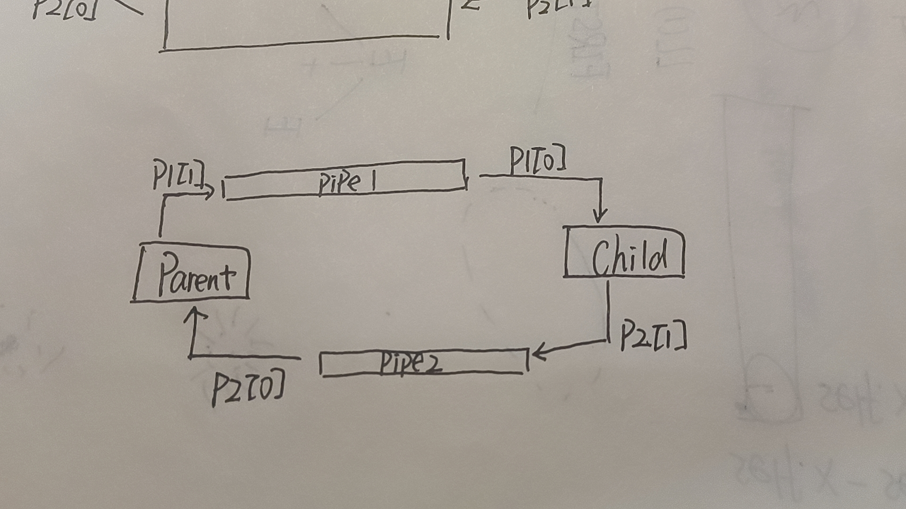
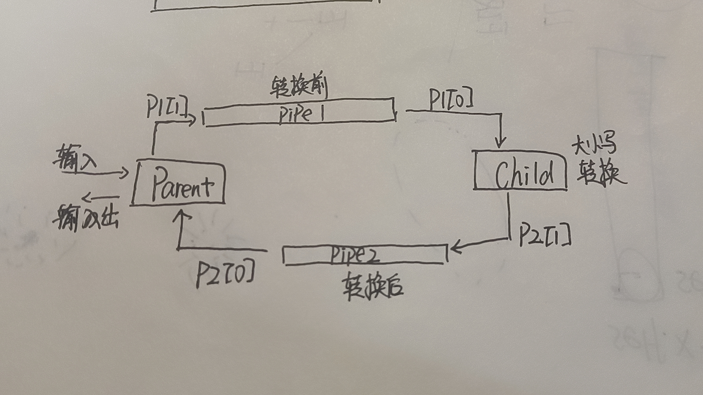

# 实验一
### 实验内容
采用系统调用fork()，编写一个C程序，以便在子进程中生成这个序列。要求：
* 从命令行提供启动数字
* 由子进程输出数字序列
* 父进程等子进程结束后再退出
### 开发环境
* 操作系统：Ubuntu
* 调试软件名称：VScode
* gcc version 11.4.0
### 主要系统调用
* `fork()`
    * 用于创建一个新的进程。调用fork函数后，操作系统会复制当前进程的上下文，包括代码、数据和堆栈等，并创建一个新的子进程。子进程与父进程几乎完全相同，但是它具有独立的进程 ID（PID）。
    * 在fork函数的返回值上有不同的处理方式。对于父进程，fork函数返回新创建子进程的PID；对于子进程，fork函数返回0。这样可以通过判断fork函数的返回值来区分父进程和子进程，并在代码中采取不同的逻辑。
    * 子进程可以继续执行父进程的代码，或者通过调用exec函数族中的某个函数来执行新的程序。通过fork函数，我们可以方便地创建子进程来执行并发任务，实现进程的拓展和简化编程模型。
* `wait()`
    * 用于等待子进程的终止并获取子进程的退出状态。当一个子进程终止时，它的终止状态（包括退出码）让其父进程可以通过wait函数来获取。
    * wait函数有几种不同的形式，其中最常用的是waitpid函数。waitpid函数可以指定等待的子进程的PID，也可以使用特殊的值来表示等待任意子进程。
    * 调用waitpid函数时，父进程会阻塞等待，直到一个子进程终止。当子进程终止后，waitpid会返回子进程的PID以及子进程的终止状态，父进程可以通过这些信息来了解子进程的执行情况。
    * 在获取子进程状态后，父进程可以根据子进程的退出状态来确定子进程的终止原因，例如正常退出还是异常退出，并对子进程做进一步的处理。
    * wait函数的使用可以实现父子进程之间的同步，让父进程等待子进程的完成，确保正确的执行顺序和避免资源冲突。
### 程序设计
```C
#include <unistd.h>
#include <stdio.h>
#include <stdlib.h>
#include <sys/types.h>
#include <sys/wait.h>
void Collatz(int);
int main(int argc, char *argv[])
{
    int num = 35;
    if (argc >= 2)
        num = atoi(argv[1]) > 0 ? atoi(argv[1]) : 35;
    int fpid = fork();
    if (fpid < 0)
        printf("error in fork.\n");
    else if (fpid == 0)
    {
        printf("I am the child process, my process id is %d\n", getpid());
        Collatz(num);
        printf("ID: %d quit\n", getpid());
        return 1;
    }
    printf("I am the parent process, my process id is %d\n", getpid());
    wait(NULL);
    printf("ID: %d quit\n", getpid());
    return 0;
}

void Collatz(int num)
{
    int i = num, j = 1;
    printf("%d ", i);
    while (i != 1)
    {
        if (i % 2)
        {
            i = 3 * i + 1;
        }
        else
        {
            i = i / 2;
        }
        printf("%d ", i);
        j++;
        if (j % 5 == 0)
        {
            printf("\n");
            j = 0;
        }
    }
    printf("\n");
}
```
### 运行结果
* 结果1：采用默认数字

* 结果2：自己传入数字

### 结果分析
* 结果1：
    * 父进程ID：2847
    * 子进程ID：2848
    * 输入值：默认
    * 首先程序先执行父进程，然后到子进程，之后打印出数字序列，最后子进程先退出之后父进程才退出。
    * 原因：父进程中需要执行代码wait(NULL)，即等待子进程结束。
* 结果2：（于结果1类似）
    * 父进程ID：2847
    * 子进程ID：2848
    * 输入值：50
    * 首先程序先执行父进程，然后到子进程，之后打印出数字序列，最后子进程先退出之后父进程才退出。
    * 原因：父进程中需要执行代码wait(NULL)，即等待子进程结束。
* 遇到不合法输入也会采用默认值，原因：`num = atoi(argv[1]) > 0 ? atoi(argv[1]) : 35;`
# 实验二
### 实验内容
* 以共享内存技术编程实现Collatz猜想。
* 要求在父子进程之间建立一个共享内存对象，允许子进程将序列内容写入共享内存对象，当子进程完成时，父进程输出序列。
* 父进程包括如下步骤：
    * 建立共享内存对象（shm_open(), ftruncate(), mmap()）
    * 建立子进程并等待他终止
    * 输出共享内存的内容
    * 删除共享内存对象。
### 开发环境
* 操作系统：Ubuntu
* 调试软件名称：VScode
* gcc version 11.4.0
### 主要系统调用
* `fork()`
* `wait()`
* `int shm_open(const char *name, int oflag, mode_t mode)`
    * 功能说明：shm_open　用于创建或者打开共享内存文件。笔者认为shm_open 也许仅仅是系统函数open的一个包装，不同之处就是shm_open操作的文件一定是位于tmpfs文件系统里的，常见的Linux发布版的tmpfs文件系统的存放目录就是/devm。
    * 返回值：shm_open函数的返回值是一个文件描述符（file descriptor），它是一个非负整数。文件描述符是用来标识打开文件或其他I/O资源的句柄。如果shm_open成功创建或打开共享内存对象，则返回一个有效的文件描述符。该文件描述符可以用于后续操作，比如读取、写入、映射到内存等。如果shm_open失败，则返回-1，并设置适当的错误代码，表示出现了错误。
    * 参数说明：
        * name：要打开或创建的共享内存文件名，由于shm_open　打开或操作的文件都是位于/devm目录的，因此name不能带路径，例如：ar/myshare 这样的名称是错误的，而 myshare 是正确的，因为 myshare 不带任何路径。如果你一定要在name添加路径，那么，请在/devm目录里创建一个目录，例如，如果你想创建一个  bill/myshare 的共享内存文件，那么请先在/devm目录里创建 bill这个子目录，由于不同厂家发布的linux系统的tmpfs的位置也许不是/devm，因此带路径的名称也许在别的环境下打开不成功。
        * oflag：打开的文件操作属性：O_CREAT、O_RDWR、O_EXCL的按位或运算组合
        * mode：文件共享模式
* `void* mmap(void *addr, size_t length, int prot, int flags,int fd, off_t offset)`
    * 功能说明: 将打开的文件映射到内存，一般是将shm_open打开的文件映射到内存，当然也可以将硬盘上的用open函数打开的文件映射到内存。这个函数只是将文件映射到内存中，使得我们用操作内存指针的方式来操作文件数据。
    * 参数说明：
        * addr：要将文件映射到的内存地址，一般应该传递NULL来由Linux内核指定。
        * length：要映射的文件数据长度。
        * prot：映射的内存区域的操作权限（保护属性）
        * flags：标志位参数，包括：MAP_SHARED、MAP_PRIVATE与MAP_ANONYMOUS。
        * fd：用来建立映射区的文件描述符，用 shm_open打开或者open打开的文件。
        * offset：映射文件相对于文件头的偏移位置，应该按4096字节对齐。
* `int ftruncate(int fd, off_t length)`
    * 功能说明：重置文件大小。任何open打开的文件都可以用这个函数，不限于shm_open打开的文件。
    * 返回值：为0表示成功，-1表示失败，并设置相应的错误码。
    * 参数说明：
        * fd：文件描述符，表示要改变大小的文件。
        * length：新的文件大小，单位是字节。
    * ftruncate函数将文件的大小截断为指定的长度，可能会有以下几种情况：
        * 如果length小于文件的当前大小，文件将被截断，超过length部分的数据将被丢弃。
        * 如果length大于文件的当前大小，文件将被扩展，超过当前大小但在length之前的部分将被填充为零字节。

### 程序设计
```C
#include <stdio.h>
#include <stdlib.h>
#include <string.h>
#include <errno.h>
#include <fcntl.h>
#include <signal.h>
#include <sys/ipc.h>
#include <sys/mman.h>
#include <sys/shm.h>
#include <sys/stat.h>
#include <sys/types.h>
#include <sys/wait.h>
#include <unistd.h>

int main(int argc, char *argv[])
{
    const int SIZE = 4096;
    const char *name = "OS_2.2";
    int N = 35;
    if (argc >= 2)
        N = atoi(argv[1]) > 0 ? atoi(argv[1]) : 35;
    int pid = fork();
    if (pid < 0) {
        printf("Error in fork.\n");
        return -1;
    } else if (pid == 0) {
        char *message;
        char *ptr1;
        printf("I am the child process, my process id is %d\n", getpid());
        int shm_fd1 = shm_open(name, O_CREAT | O_RDWR, 0777);
        if (shm_fd1 < 0) {
            printf("Open the shm1 failed!\n");
            return -1;
        } else {
            char cur_num[10] = {'\0'};
            sprintf(cur_num, "%d", N);
            message = (char *)malloc(sizeof(char));
            message = realloc(message, strlen(cur_num));
            if (message == NULL){
                printf("Realloc error\n");
                exit(1);
            }
            sprintf(message, "%s", cur_num);
            while (N != 1) {
                if (N % 2 == 0) {
                    N = N / 2;
                } else {
                    N = 3 * N + 1;
                }
                sprintf(cur_num, "%d", N);
                message = realloc(message, strlen(message) + strlen(cur_num) + 1);
                if (message == NULL){
                    printf("Realloc error\n");
                    exit(1);
                }
                // 新数字与旧数字之间隔一个空格
                sprintf(message, "%s %s", message, cur_num);
            }
            printf("Successfully done, transmitting...\n");
            // 改变共享内存文件的大小为SIZE
            ftruncate(shm_fd1, SIZE);
            ptr1 = mmap(0, SIZE, PROT_WRITE, MAP_SHARED, shm_fd1, 0);
            sprintf(ptr1, "%s", message);
            ptr1 += strlen(message);
            free(message);
        }
        printf("ID: %d quit\n", getpid());
    } else {
        printf("I am the parent process, my process id is %d\n", getpid());
        wait(NULL);
        char *ptr2;
        int shm_fd2 = shm_open(name, O_CREAT | O_RDWR, 0777);
        if (shm_fd2 < 0) {
            printf("Open the shm2 failed!\n");
            return -1;
        } else {
            ptr2 = mmap(0, SIZE, PROT_WRITE, MAP_SHARED, shm_fd2, 0);
            printf("%s\n", (char *)ptr2);
            // 断开共享内存
            shm_unlink(name);
        }
        printf("ID: %d quit\n", getpid());
    }
    return 0;
}

```
### 运行结果

### 结果分析
* 父进程ID：5635
* 子进程ID：5636
* 输入值：50
* 共享内存的名字：OS_2.2
* 首先程序先执行父进程，然后到子进程。之后子进程中对共享内存"OS_2.2"，计算出对应输入的输出（这里申请的是动态内存，因为不知道对应输入的输出所占内存空间的大小），每计算出一个就写入一个到共享内存中，写入完成输出"Successfully done, transmitting..."。在子进程写入的过程中父进程等待子进程结束，之后父进程读出共享内存"OS_2.2"中的值，然后进行打印，最后删除共享内存对象。
# 实验三
### 实验内容
* 设计一个程序，通过普通管道进行通信，让一个进程发送一个字符串消息给第二个进程，第二个进程收到此消息后，变更字母的大小写，然后再发送给第一个进程。比如，第一个进程发消息：“I am Here”，第二个进程收到后，将它改变为：“i AM hERE”之后，再发给第一个进程。
* 提示：
    * （1）需要创建子进程，父子进程之间通过普通管道进行通信。
    * （2）需要建立两个普通管道。
### 开发环境
* 操作系统：Ubuntu
* 调试软件名称：VScode
* gcc version 11.4.0
### 主要系统调用
* `int pipe(int fds[2])`
    * 功能：创建一个单向管道
    * 返回值：0表示成功，-1表示失败
    * 参数：
        * fd[0] 将是管道读取端的fd（文件描述符）
        * fd[1] 将是管道写入端的fd
* `read()`
    - 参数1：文件描述符（file descriptor），表示要读取数据的文件描述符。
    - 参数2：缓冲区（buffer），用于存储读取到的数据。
    - 参数3：读取数据的最大字节数。
    - 返回值：实际读取到的字节数。如果返回值为0，表示已经到达文件末尾；若返回-1，表示读取出错，可以通过`errno`变量获取具体错误信息。
* `write()`：
    - 参数1：文件描述符，表示要写入数据的文件描述符。
    - 参数2：要写入的数据缓冲区。
    - 参数3：要写入的字节数。
    - 返回值：实际写入的字节数。如果返回值为-1，表示写入出错，可以通过`errno`变量获取具体错误信息。
### 程序设计
```C
#include <ctype.h>
#include <errno.h>
#include <fcntl.h>
#include <signal.h>
#include <stdio.h>
#include <stdlib.h>
#include <string.h>
#include <sys/ipc.h>
#include <sys/mman.h>
#include <sys/shm.h>
#include <sys/stat.h>
#include <sys/types.h>
#include <sys/wait.h>
#include <unistd.h>

#define SIZE 4096

int main()
{
    int p1[2], p2[2], pid;
    printf("Input string that you want to tranform.\n");
    if ((pipe(p1) < 0) || (pipe(p2) < 0)) {
        printf("Creat pipe error.\n");
        exit(1);
    }
    if ((pid = fork()) > 0) { // parent
        printf("I am the parent process, my process id is %d\n", getpid());
        char buf[SIZE] = {'\0'};
        int nbytes;
        fgets(buf, SIZE, stdin);
        if (write(p1[1], buf, strlen(buf)) < 0) {
            printf("Write error.\n");
            exit(1);
        }
        close(p1[1]);
        printf("Parent write: %s", buf);
        wait(NULL);
        while ((nbytes = read(p2[0], buf, SIZE)) > 0) {
            printf("Parent read: %s", buf);
            break;
        }
        if (nbytes < 0) {
            printf("Read error.\n");
            exit(1);
        }
        close(p2[0]);
    } else { // child
        printf("I am the child process, my process id is %d\n", getpid());
        char buf[SIZE] = {'\0'};
        int nbytes;
        while ((nbytes = read(p1[0], buf, SIZE)) > 0) {
            printf("Child read: %s", buf);
            int i = 0;
            while (buf[i]) {
                if (isupper(buf[i])) {
                    buf[i] = tolower(buf[i]);
                } else if (islower(buf[i])) {
                    buf[i] = toupper(buf[i]);
                }
                i++;
            }
            if (write(p2[1], buf, strlen(buf)) < 0) {
                printf("Write error.\n");
                exit(1);
            }
            close(p2[1]);
            printf("Child write: %s", buf);
            break;
        }
        if (nbytes < 0) {
            printf("Read error.\n");
            exit(1);
        }
        close(p1[0]);
        printf("ID: %d quit\n", getpid());
        exit(10);
    }
    printf("ID: %d quit\n", getpid());
    return 0;
}
```
### 运行结果

### 结果分析
* 父进程ID：9957
* 子进程ID：9958
* 输入：Are you OK? I'm fine, thank you. And you? I am fine, too.
* 首先父进程读入键盘输入，然后将其写入到管道p1里面，然后等待子进程结束。在子进程中，首先从p1管道里读取数据，然后将其大小写转换后，写入p2管道里，之后子进程结束。然后父进程继续执行，这时候父进程读取p2管道里面的数据就可以。
    * Parent write: 父进程写到管道p1里面的内容。
    * Child read: 子进程读取管道p1里面的内容。
    * Child write: 子进程写到管道p2里面的内容。
    * Parent read: 父进程读取管道p2里面的内容。




