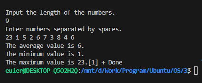
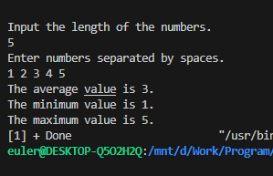
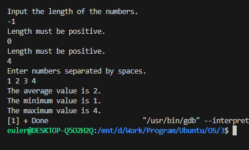

# 实验一
### 实验内容
编写一个多线程程序，计算数字列表的各种统计值。该程序将接受键盘上的一系列数字，然后创建三个独立的工作线程。一个线程将确定数字的平均值，第二个将确定最大值，第三个将确定最小值。\
表示平均值、最小值和最大值的变量将全局存储。工作线程将设置这些值，一旦工作线程退出，父线程将输出这些值。
### 程序设计
* API
```C
#include <pthread.h>

/*
pthread_create()用于创建线程
thread： 接收创建的线程的 ID
attr： 指定线程的属性//一般传NULL
start_routine：指定线程函数
arg： 给线程函数传递的参数
成功返回 0， 失败返回错误码
*/
int pthread_create(pthread_t * thread, const pthread_attr_t *attr,void *(*start_routine) ( void *),void *arg);


/*
pthread_exit()退出线程
retval：指定退出信息
*/
int pthread_exit( void *retval);


/*
pthread_join()等待 thread 指定的线程退出，线程未退出时，该方法阻塞
retval：接收 thread 线程退出时，指定的退出信息
*/
int pthread_join(pthread_t thread, void **retval);

```
* 设计说明
    * 函数：
        * `void ReadNumbers(int *arry);`用于用户输入
        * `void PrintNumbers(int *arry);`用于打印数组中的数字，测试用
        * `void *ComputAvg(void *arg);`用于在线程中计算平均值
        * `void *ComputMax(void *arg);`用于在线程中计算最大值
        * `void *ComputMin(void *arg);`用于在线程中计算最小值
    * 全局变量`int avg, max, min;`分别用于存储平均值、最大值和最小值
    * 主函数逻辑：先读取整个数字序列中的长度，然后申请内存空间，申请的长度为序列长度加1，数组第一个元素保存序列长度。创建3个线程，等待3个线程结束，打印输出。

```C
#include <pthread.h>
#include <stdio.h>
#include <stdlib.h>
#include <string.h>

int avg, max, min;
void ReadNumbers(int *arry);
void PrintNumbers(int *arry);
void *ComputAvg(void *arg);
void *ComputMax(void *arg);
void *ComputMin(void *arg);

void OutputResult();

int main()
{
    int len;
    printf("Input the length of the numbers.\n");
    scanf("%d", &len);
    while (len <= 0) {
        printf("Length must be positive.\n");
        scanf("%d", &len);
    }
    int *arry = (int *)malloc(sizeof(int) * (len + 1));
    if (arry == NULL) {
        printf("Malloc error.\n");
        return -1;
    }
    arry[0] = len;
    ReadNumbers(arry);
    pthread_t id[3];
    pthread_create(&id[0], NULL, ComputAvg, (void *)arry);
    pthread_create(&id[1], NULL, ComputMin, (void *)arry);
    pthread_create(&id[2], NULL, ComputMax, (void *)arry);
    for (int i = 0; i < 3; i++) {
        pthread_join(id[i], NULL);
    }
    OutputResult();
    return 0;
}
void ReadNumbers(int *arry)
{
    printf("Enter numbers separated by spaces.\n");
    for (int i = 1; i <= arry[0]; i++) {
        scanf("%d", &arry[i]);
    }
}

void PrintNumbers(int *arry)
{
    printf("Numbers you input.\n");
    for (int i = 1; i <= arry[0]; i++) {
        printf("%d ", arry[i]);
    }
}

void *ComputAvg(void *arg)
{
    int *arry = (int *)arg;
    avg = 0;
    for (int i = 1; i <= arry[0]; i++) {
        avg += arry[i];
    }
    avg /= arry[0];
}

void *ComputMax(void *arg)
{
    int *arry = (int *)arg;
    max = arry[1];
    for (int i = 1; i <= arry[0]; i++) {
        max = max < arry[i] ? arry[i] : max;
    }
}

void *ComputMin(void *arg)
{
    int *arry = (int *)arg;
    min = arry[1];
    for (int i = 1; i <= arry[0]; i++) {
        min = min > arry[i] ? arry[i] : min;
    }
}

void OutputResult()
{
    printf("The average value is %d.\n", avg);
    printf("The minimum value is %d.\n", min);
    printf("The maximum value is %d.\n", max);
}
```


### 测试报告
* 测试用例1\
9\
23 1 5 2 6 7 3 8 4 6
* 测试用例2\
5\
1 2 3 4 5
* 测试用例3（不合理序列长度）\
-1\
0\
4\
1 2 3 4

* 运行结果1\


* 运行结果2\


* 运行结果3（不合理序列长度）\
\
直到输入长度合理为止

* 结果分析\
首先在主函数中，也就是主线程中读入序列长度和数字序列，然后创建三个线程进行计算，将值保存到对应的全局变量中，然后主线程等待所有子线程结束，最后打印输出。

# 实验二
### 实验内容

### 程序设计
* API
```C
#include <pthread.h>

/*
pthread_create()用于创建线程
thread： 接收创建的线程的 ID
attr： 指定线程的属性//一般传NULL
start_routine：指定线程函数
arg： 给线程函数传递的参数
成功返回 0， 失败返回错误码
*/
int pthread_create(pthread_t * thread, const pthread_attr_t *attr,void *(*start_routine) ( void *),void *arg);


/*
pthread_exit()退出线程
retval：指定退出信息
*/
int pthread_exit( void *retval);


/*
pthread_join()等待 thread 指定的线程退出，线程未退出时，该方法阻塞
retval：接收 thread 线程退出时，指定的退出信息
*/
int pthread_join(pthread_t thread, void **retval);

```
* 设计说明
    * 函数：
        * `void ReadNumbers(int *arry);`用于用户输入
        * `void PrintNumbers(int *arry);`用于打印数组中的数字，测试用
        * `void *ComputAvg(void *arg);`用于在线程中计算平均值
        * `void *ComputMax(void *arg);`用于在线程中计算最大值
        * `void *ComputMin(void *arg);`用于在线程中计算最小值
    * 全局变量`int avg, max, min;`分别用于存储平均值、最大值和最小值
    * 主函数逻辑：先读取整个数字序列中的长度，然后申请内存空间，申请的长度为序列长度加1，数组第一个元素保存序列长度。创建3个线程，等待3个线程结束，打印输出。

```C

```


### 测试报告
* 测试用例1\

* 测试用例2\

* 测试用例3（不合理序列长度）\


* 运行结果1\

* 运行结果2\

* 运行结果3（不合理序列长度）\


* 结果分析\
