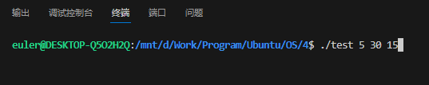
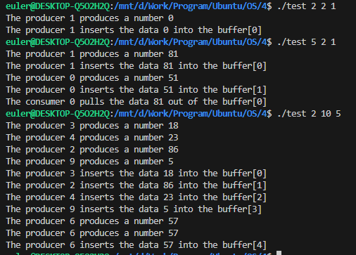

# 实验四——进程同步实验
### 实验内容
* (1) 缓冲区
    * (a) 缓冲区存储结构建议采用固定大小的数组表示，并作为环形队列处理。
    * (b) 缓冲区的访问算法按照课本 6.6.1 节图 6.10、图 6.11 进行设计。
    
* (2) 主函数 main()
    * (a) 主函数需要创建一定数量的生产者线程与消费者线程。线程创建完毕
    后，主函数将睡眠一段时间，并在唤醒时终止应用程序。
    * (b) 主函数需要从命令行接受三个参数：睡眠时长、生产者线程数量、消
    费者线程数量。
* (3) 生产者与消费者线程
    * (a) 生产者线程：随机睡眠一段时间，向缓冲区插入一个随机数。
    * (b) 消费者线程：随机睡眠一段时间，从缓冲区去除一个随机数。
### 开发环境
* 操作系统：openEuler
* 调试软件名称：VScode
* gcc version 11.4.0
### 主要系统调用
```C
/*
pthread_create()用于创建线程
thread： 接收创建的线程的 ID
attr： 指定线程的属性//一般传NULL
start_routine：指定线程函数
arg： 给线程函数传递的参数
成功返回 0， 失败返回错误码
*/
int pthread_create(pthread_t * thread, const pthread_attr_t *attr,void *(*start_routine) ( void *),void *arg);

/*
功能：初始化信号量
参数：
    1.sem_t *sem：所需初始化信号量 sem 的地址。
    2.int pshared：表明该信号量是否被同一进程下的线程或其他进程共享。0 表示该信号量可以在同一进程下的线程所共享；如果不是 0 则表示该信号量可以在进程间共享。
    3.unsigned int value：信号量初始值。
返回值：初始化成功则返回 0，失败则返回-1。
*/
int sem_init(sem_t *sem, int pshared, unsigned int value)

/*
功能：如果信号量的值大于零，则减量继续进行，函数立即返回。 如果信号量当前的值为零，则调用将阻塞，直到有可能执行减量操作为止。
参数：
    信号量 sem 的地址。
返回值：运行成功则返回 0，失败返回-1。
*/
int sem_wait(sem_t *sem)

/*
功能：解锁信号量 sem。
参数：
    信号量 sem 的地址。
返回值：运行成功则返回 0，失败返回-1。
*/
int sem_post(sem_t *sem)
```
### 程序设计
* 全局变量：
    * `#define N 25`：缓冲区大大小
    * `#define SLEEP_TIME 5`：默认主函数睡眠时间
    * `#define PRODUCER 10`：默认生产者数量
    * `#define CONSUMER 5`：默认消费者数量
    * `sem_t mutex`：用于对缓冲区互斥的信号量
    * `sem_t full`：用于记录缓冲区是否有元素的信号量
    * `sem_t empty`：用于记录缓冲区是否为空的信号量
    * `int start`：用于记录当前缓冲区即将插入数据的下标
    * `int end`：用于记录当前缓冲区第一个可用元素的下标
* 函数：
    * `int is_all_digits(char *str)`
        * 功能：判断传入主函数的字符串是全部为数字
        * 参数：
            * `char *str`：str是待检测的字符串
        * 返回值：-1代表不全是数字，0代表全为数字
    * `void *Produser(void *arg)`
        * 功能：生产者线程，在其临界区中进行对变量end递增和向缓冲区插入数据的操作。
        * 参数：
            * `void *arg`：arg是线程id
        * 返回值：无
    * `void *Consumer(void *arg)`
        * 功能：消费者线程，在其临界区中进行变量start递增和向缓冲区读取数据的操作。
        * 参数：
            * `void *arg`：arg是线程id
        * 返回值：无
    * `int main(int argc, char *argv[])`
        * 功能：实现了参数读入，变量初始化。实现了对生产者进程和消费者进程的创建。
        * 参数：终端传入的参数和参数数目
        * 返回值：0
* 代码：
```C
#include <ctype.h>
#include <pthread.h>
#include <semaphore.h>
#include <stdio.h>
#include <stdlib.h>
#include <string.h>
#include <time.h>
#include <unistd.h>
#define N 25
#define SLEEP_TIME 5
#define PRODUCER 10
#define CONSUMER 5

sem_t mutex, full, empty;
int buffer[N];
int start = 0, end = 0;

int is_all_digits(char *str);
void *Produser(void *arg);
void *Consumer(void *arg);

int main(int argc, char *argv[])
{
    // 参数初始化
    int sleep_time = SLEEP_TIME;
    int producer = PRODUCER;
    int consumer = CONSUMER;
    srand((unsigned)time(NULL));
    if (argc >= 2) {
        if (is_all_digits(argv[1]))
            sleep_time = atoi(argv[1]);
    }
    if (argc >= 3) {
        if (is_all_digits(argv[2]))
            producer = atoi(argv[2]);
    }
    if (argc >= 4) {
        if (is_all_digits(argv[3]))
            consumer = atoi(argv[3]);
    }
    // 初始化信号量
    if (sem_init(&empty, 0, N) == -1 || sem_init(&full, 0, 0) == -1 || sem_init(&mutex, 0, 1) == -1) {
        printf("sem_init error.");
        return 0;
    }
    // 创建线程
    pthread_t *pid = (pthread_t *)malloc(sizeof(pthread_t) * (producer + consumer));
    int *id = (int *)malloc(sizeof(int) * (producer + consumer));
    if (id == NULL || pid == NULL) {
        printf("malloc error.");
        return 0;
    }
    for (int i = 0; i < producer; i++) {
        id[i] = i;
        pthread_create(&pid[i], NULL, Produser, (void *)&id[i]);
    }
    for (int i = 0; i < consumer; i++) {
        id[i + producer] = i + producer;
        pthread_create(&pid[i + producer], NULL, Consumer, (void *)&id[i]);
    }
    sleep(sleep_time);
    return 0;
}

int is_all_digits(char *str)
{
    int i;
    for (i = 0; str[i] != '\0'; i++) {
        if (!isdigit(str[i])) {
            return 0;
        }
    }
    return 1;
}

void *Produser(void *arg)
{
    int id = *(int *)arg;
    int num;
    int sleep_time;
    while (1) {
        sleep_time = rand() % 3000 + 1000;
        sleep(0.001 * sleep_time);
        num = rand() % 100;
        printf("The producer %d produces a number %d\n", id, num);
        sem_wait(&empty);
        sem_wait(&mutex);
        buffer[end] = num;
        printf("The producer %d inserts the data %d into the buffer[%d]\n", id, num, end);
        end = end + 1 == N ? 0 : end + 1;
        sem_post(&mutex);
        sem_post(&full);
    }
}

void *Consumer(void *arg)
{
    int id = *(int *)arg;
    int sleep_time;
    while (1) {
        srand((unsigned)time(NULL));
        sleep_time = rand() % 3000 + 1000;
        sleep(0.001 * sleep_time);
        sem_wait(&full);
        sem_wait(&mutex);
        printf("The consumer %d pulls the data %d out of the buffer[%d]\n", id, buffer[start], start);
        start = start + 1 == N ? 0 : start + 1;
        sem_post(&mutex);
        sem_post(&empty);
    }
}
```
### 运行结果

```txt
The producer 2 produces a number 90
The producer 2 inserts the data 90 into the buffer[0]
The producer 11 produces a number 25
The producer 11 inserts the data 25 into the buffer[1]
The producer 4 produces a number 86
The producer 6 produces a number 74
The producer 4 inserts the data 86 into the buffer[2]
The producer 10 produces a number 97
The producer 10 inserts the data 97 into the buffer[3]
The producer 15 produces a number 94
The producer 25 produces a number 25
The producer 27 produces a number 75
The producer 22 produces a number 85
The producer 26 produces a number 76
The producer 21 produces a number 90
The producer 8 produces a number 49
The producer 6 inserts the data 74 into the buffer[4]
The producer 16 produces a number 26
The producer 16 inserts the data 26 into the buffer[5]
The producer 25 inserts the data 25 into the buffer[6]
The producer 27 inserts the data 75 into the buffer[7]
The producer 22 inserts the data 85 into the buffer[8]
The producer 26 inserts the data 76 into the buffer[9]
The producer 21 inserts the data 90 into the buffer[10]
The producer 8 inserts the data 49 into the buffer[11]
The producer 15 inserts the data 94 into the buffer[12]
The producer 11 produces a number 16
The producer 11 inserts the data 16 into the buffer[13]
The producer 12 produces a number 49
The producer 12 inserts the data 49 into the buffer[14]
The producer 14 produces a number 96
The producer 14 inserts the data 96 into the buffer[15]
The producer 24 produces a number 55
The producer 24 inserts the data 55 into the buffer[16]
The producer 4 produces a number 50
The producer 4 inserts the data 50 into the buffer[17]
The producer 19 produces a number 30
The producer 19 inserts the data 30 into the buffer[18]
The producer 27 produces a number 35
The producer 27 inserts the data 35 into the buffer[19]
The producer 22 produces a number 97
The producer 22 inserts the data 97 into the buffer[20]
The producer 15 produces a number 37
The producer 8 produces a number 81
The producer 8 inserts the data 81 into the buffer[21]
The producer 15 inserts the data 37 into the buffer[22]
The producer 3 produces a number 88
The producer 18 produces a number 58
The producer 0 produces a number 25
The producer 6 produces a number 56
The producer 7 produces a number 41
The producer 9 produces a number 21
The producer 27 produces a number 29
The producer 23 produces a number 76
The producer 17 produces a number 18
The producer 20 produces a number 36
The producer 3 inserts the data 88 into the buffer[23]
The producer 28 produces a number 87
The producer 1 produces a number 6
The producer 12 produces a number 60
The producer 29 produces a number 76
The producer 24 produces a number 73
The producer 5 produces a number 11
The producer 19 produces a number 6
The producer 21 produces a number 29
The producer 13 produces a number 99
The consumer 0 pulls the data 90 out of the buffer[0]
The consumer 3 pulls the data 25 out of the buffer[1]
The producer 0 inserts the data 25 into the buffer[24]
The consumer 2 pulls the data 86 out of the buffer[2]
The consumer 6 pulls the data 97 out of the buffer[3]
The consumer 7 pulls the data 74 out of the buffer[4]
The producer 7 inserts the data 41 into the buffer[0]
The producer 9 inserts the data 21 into the buffer[1]
The consumer 10 pulls the data 26 out of the buffer[5]
The consumer 9 pulls the data 25 out of the buffer[6]
The producer 23 inserts the data 76 into the buffer[2]
The consumer 8 pulls the data 75 out of the buffer[7]
The consumer 11 pulls the data 85 out of the buffer[8]
The producer 17 inserts the data 18 into the buffer[3]
The consumer 12 pulls the data 76 out of the buffer[9]
The producer 28 inserts the data 87 into the buffer[4]
The producer 6 inserts the data 56 into the buffer[5]
The consumer 4 pulls the data 90 out of the buffer[10]
The producer 27 inserts the data 29 into the buffer[6]
The consumer 5 pulls the data 49 out of the buffer[11]
The producer 29 inserts the data 76 into the buffer[7]
The producer 18 inserts the data 58 into the buffer[8]
The producer 20 inserts the data 36 into the buffer[9]
The consumer 13 pulls the data 94 out of the buffer[12]
The producer 1 inserts the data 6 into the buffer[10]
The producer 24 inserts the data 73 into the buffer[11]
The producer 12 inserts the data 60 into the buffer[12]
The consumer 1 pulls the data 16 out of the buffer[13]
The producer 5 inserts the data 11 into the buffer[13]
The consumer 14 pulls the data 49 out of the buffer[14]
The producer 19 inserts the data 6 into the buffer[14]
The producer 2 produces a number 95
The producer 10 produces a number 5
The producer 25 produces a number 29
The producer 26 produces a number 19
The producer 16 produces a number 56
The producer 8 produces a number 53
The consumer 0 pulls the data 96 out of the buffer[15]
The consumer 3 pulls the data 55 out of the buffer[16]
The consumer 2 pulls the data 50 out of the buffer[17]
The producer 13 inserts the data 99 into the buffer[15]
The producer 7 produces a number 41
The producer 0 produces a number 35
The producer 23 produces a number 41
The producer 21 inserts the data 29 into the buffer[16]
The producer 17 produces a number 19
The consumer 11 pulls the data 30 out of the buffer[18]
The producer 2 inserts the data 95 into the buffer[17]
The consumer 12 pulls the data 35 out of the buffer[19]
The consumer 6 pulls the data 97 out of the buffer[20]
The producer 10 inserts the data 5 into the buffer[18]
The producer 28 produces a number 41
The producer 28 inserts the data 41 into the buffer[19]
The consumer 9 pulls the data 81 out of the buffer[21]
The producer 16 inserts the data 56 into the buffer[20]
The consumer 8 pulls the data 37 out of the buffer[22]
The consumer 10 pulls the data 88 out of the buffer[23]
The consumer 7 pulls the data 25 out of the buffer[24]
The producer 0 inserts the data 35 into the buffer[21]
The producer 27 produces a number 41
The producer 26 inserts the data 19 into the buffer[22]
The producer 8 inserts the data 53 into the buffer[23]
The producer 7 inserts the data 41 into the buffer[24]
The consumer 4 pulls the data 41 out of the buffer[0]
The producer 23 inserts the data 41 into the buffer[0]
The consumer 5 pulls the data 21 out of the buffer[1]
The producer 17 inserts the data 19 into the buffer[1]
The producer 29 produces a number 41
The consumer 13 pulls the data 76 out of the buffer[2]
The producer 25 inserts the data 29 into the buffer[2]
The producer 1 produces a number 41
The producer 19 produces a number 19
The consumer 1 pulls the data 18 out of the buffer[3]
The producer 5 produces a number 53
The producer 5 inserts the data 53 into the buffer[3]
The consumer 14 pulls the data 87 out of the buffer[4]
The producer 29 inserts the data 41 into the buffer[4]
The producer 11 produces a number 41
The producer 11 produces a number 41
The producer 14 produces a number 19
```

### 结果分析
实现了利用信号量机制，解决有限缓冲的生产者-消费者问题。
### 遇到的问题
* 问题1：生成的随机有一些数是一样的。
* 解决办法：将`srand((unsigned)time(NULL))`放在主函数中，而不是每个生产者函数里。
