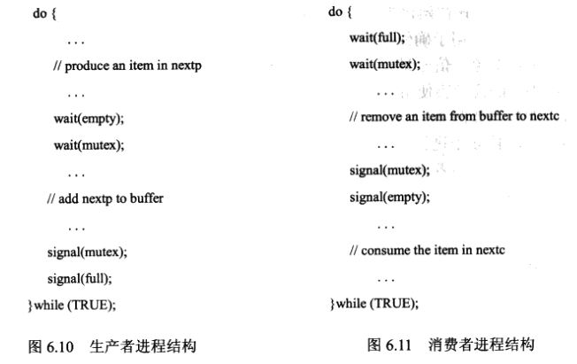

# 实验四——进程同步实验
### 实验内容
* (1) 缓冲区
    * (a) 缓冲区存储结构建议采用固定大小的数组表示，并作为环形队列处理。
    * (b) 缓冲区的访问算法按照课本 6.6.1 节图 6.10、图 6.11 进行设计。
    
* (2) 主函数 main()
    * (a) 主函数需要创建一定数量的生产者线程与消费者线程。线程创建完毕
    后，主函数将睡眠一段时间，并在唤醒时终止应用程序。
    * (b) 主函数需要从命令行接受三个参数：睡眠时长、生产者线程数量、消
    费者线程数量。
* (3) 生产者与消费者线程
    * (a) 生产者线程：随机睡眠一段时间，向缓冲区插入一个随机数。
    * (b) 消费者线程：随机睡眠一段时间，从缓冲区去除一个随机数。
### 开发环境
* 操作系统：Ubuntu
* 调试软件名称：VScode
* gcc version 11.4.0
### 主要系统调用

### 程序设计

### 运行结果

### 结果分析

